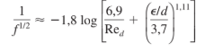

# Perda de Carga

Integrantes: Érick Marcelino Miranda (ErickLuoying) - 17/0009521, Giovanni Rambo de Freitas (GiovanniRambo) - 16/0007445, Raul Braga da Costa (Raul-10) - 16/0142954.

## Objetivo

O objetivo da atividade é analisar, através de um experimento, a perda de carga de um escoamento em dutos devido ao atrito e viscosidade e verificar a correspondência entre teoria e prática.
As análises serão realizadas para o **ar** em escoamento laminar e turbulento.
Os componentes que irão compor o sistema serão tubos com diferentes comprimentos e joelhos.
A relação entre a variação da área da seção transversal dos dutos e a perda de carga também será analisada.

## Escopo

* Estudar e demonstrar a perda de carga em um escoamento cujo fluido de trabalho é o ar.

## Requisitos de solução

* Medir a diferença de pressão entre o ponto inicial e final do escoamento para assim avaliar a perda de carga do sistema.

## Requisitos detalhados e características do sistema

Para a realização do experimento, é importante a construção de um sistema na qual o experimento será realizado. Como requisitos desse sistema temos:

* Serão utilizados dutos de seção circular fabricados em PVC cor marrom.
* Os trechos serão posicionados na horizontal.
* Os trechos terão dimensões diferentes de seção transversal, constantes em cada trecho.
* A mudança de seção transversal não contará com bocais ou difusores.
* O compressor será fabricado pelos integrantes do grupo.
* Deve ser possível medir parâmetros de escoamento em pontos de interesse, para tanto será utilizado um manômetro em U para medição de pressão e um tubo de venturi para medição de velocidade no início do sistema para o cálculo da vazão, ambos instrumentos construídos pelos alunos integrantes.

Para considerar cumpridos os objetivos do experimento deve-se, no mínimo:
* Ter a estrutura do experimento concluída a tempo para a realização do experimento com qualidade suficiente.
* Ter o tubo de venturi funcionando para a medição da velocidade do fluxo de ar.
* Ter o manômetro em U funcionando para a medição da pressão do fluxo de ar.
* Deve-se obter sucesso na medição dos parâmetros do escoamento, ou seja, com uma faixa aceitável de erro quando comparado com a teoria.

## Viabilidade do Experimento

O grupo escolheu um experimento de complexidade razoável e custo tangível, determinando assim o experimento como viável. Será possível para o grupo se beneficiar do experimento, pois o mesmo possibilitará uma melhor assimilação dos conceitos da disciplina. Os resultados são previsíveis dentro de uma certa margem, viabilizando o procedimento de comprovação teórica.

## Teoria do Experimento

   Busca-se entender como ocorre a queda de pressão associada aos efeitos viscosos, focando em escoamento interno em dutos circulares.
Para isso, é importante definir um parâmetro de escoamentos viscosos que é o número de Reynolds (Re).

### Número de Reynolds

   
   
   onde: (ρref) é a massa específica de referência, (Vref) é a velocidade de referência do escoamento, (Lref) é o comprimento característico de referência e (µref) é a viscosidade de referência.
   
   Para cada caso de escoamento se define os valores de referência. Neste experimento (ρref) será a massa específica
   do ar (ρ), (Vref) velocidade média de escoamento do ar (V), (Lref) diâmetro de duto circular (D) e (µref) será a viscosidade do ar (µ). Assim sendo, temos:
   
   
   
   As perdas acontecem de maneira diferente em escoamentos laminares e turbulentos, e para se conseguir bons resultados é 
   imprescindível estudar o número de Reynolds, tendo em vista que este é o parâmetro que contribui para o entendimento de quando
   se deve fazer ou não um abordagem em regime turbulento. A relação entre o número de Reynolds e os regimes de escoamento se dá de
   acordo com as seguintes especificações:
   
   Re < 2300 - Escoamento laminar
   
   Re = 2300 - Transição
   
   Re > 2300 - Escoamento turbulento
   
   No sistema de tubos do experimento o ar primeiramente passa por um trecho de diâmetro Da, e depois por um de diâmetro Db, e isso 
   interfere no número de Reynolds, o que ocorre em razão da variação tanto da área como da velocidade do escoamento. Diante do exposto 
   levanta-se a intrigante questão: tendo em vista ambas alterações e que a velocidade e a área são inversamente proporcionais, o Re
   diminuirá ou não? Para responder esta pergunta calcula-se a razão entre Reb e Rea.
   
   
   
   A partir da lei de conservação de massa obtém-se a seguinte equação:
   
   
   
   Substituindo Va na razão dos números de Reynolds, pode-se afirmar que esta será:
   
   
   
   Sendo assim, se Da > Db, teremos que Reb > Rea.
   
   ### Perda de carga distribuida
   
   Para analisar o escoamento, considera-se a equação de Bernoulli com auxílio da perda de carga por atrito (hf) sendo o termo para compensar a perda de carga:

   
   
   Quando se usa a lei de conservação de massa em um duto circular no qual a área de seção é constante, pode-se afirmar que a velocidade média é constante ao longo do duto em situações de escoamento incompressível. À luz do exposto, e desprezando a diferença de altura entre os pontos 1 e 2, obtém-se:
   
   
   
   Mas a perda de carga por atrito também é dada por:
   
   
   
   onde f é o fator de atrito (em regime turbulento obtém-se a partir do diagrama de Moody) e L é o comprimento do duto.
   Substituindo hf em (P1-P2), temos:
   
   
   
   ### Perda de carga localizada
   
   Para um sistema que envolva tubulações existem as perdas adicionais mais conhecidas como as perdas de carga que são oriundas de: entrada e saída de tubos,expansões,contrações bruscas,curvas,cotovelos,tês,válvulas abertas ou parcialmente fechadas, expansões , contrações graduais e outros acessórios.Essa perda é calculadas a partir de:
   
   
   
   onde k é o coeficiente de perda de carga,V é uma velocidade de referência e g é a aceleração da gravidade.
   
   
   ### Medidor de Venturi
   
   É um instrumento cuja finalidade é a mensuração da velocidade de escoamento em duto de áreas variáveis quando se utiliza fluidos 
   incompressíveis. Para que se possa chegar numa expressão para a velocidade do escoamento de ar em tubo as próximas duas equações são 
   bem relevantes.
   
   
   
   
   
   A primeira equação é obtida ao se desprezar a diferença de altura entre os pontos 1 e 2 na equação de Bernoulli. Já a segunda, vem da
   lei de conservação de massa. Substituindo V2 na primeira equação e, sabendo que o fluido usado no manômetro é a água, temos:
   
   

## Procedimento de montagem e execução

### Integrantes responsáveis pelos procedimentos de montagem e execução

| Integrante | Montagem | Execução |
|--|--|--|
| Érick Marcelino | Corte dos tubos e montagem do manômetro | Realizar leituras |
| Giovanni Rambo | Montagem do compressor e juntas dos tubos | Inicializar e verificar o sistema |
| Raul Braga | Estrutura de sustentação | Realizar leituras |

### Estimativa do tempo necessário
    
De acordo com a avaliação feita pelo grupo e justificada no cronograma, a estimativa de finalização do projeto é de quatro semanas e oito dias e contempla possíveis atrasos e questões internas do grupo.

### Cronograma completo

* **Etapa 0 (07/09-14/09)** -
Dimensionamento e projeto do experimento.

Será discutido quais as dimensões dos componentes que irão compor o sistema, bem como sua disposição para que seja possível avaliar a perda de carga de forma mais eficaz.

* **Etapa 1 (14/09-19/09)** -
Orçamento, disponibilidade e compra de materiais.

Com o projeto dimensionado e esquematizado, será feita a avaliação de custo e disponibilidade dos materiais. Inicialmente essa avaliação será realizada em lojas físicas, caso seja verificada a indisponibilidade dos produtos ou custos demasiadamente elevados, a compra será realizada pela internet.

* **Etapa 2 (19/09-27/09)** -
Montagem e execução do experimento.

Em posse dos materiais, o sistema e seus subsistemas serão completamente montados e vedados com tubos e acessórios (juntas e válvulas), para que em seguida seja feita a execução do experimento assim como sua respectiva avaliação de perda de carga durante o escoamento.

* **Etapa 3 (27/09-01/10)** -
Precaução

Essa etapa consiste em um tempo bônus caso ocorram problemas na montagem ou na execução do experimento.Caso não seja necessário,essa etapa será ignorada e a seguinte antecipada.

* **Etapa 4 (01/10-16/11)** -
Análise dos dados e escrita do relatório

Com os dados obtidos da realização do experimento,serão feitas analises em comparação com a teoria para que a posteriore ocorra a escrita do relatório.

* **Etapa 5 (16/11-23/11)** -
Revisão do relatório

A partir do término do relatório será realizada a semana de revisão onde , caso necessário,os integrantes do grupo irão complementar o relatório em suas partes avaliadas como insatisfatórias.

## **Procedimento experimental**

O sistema inicialmente  será ligado ao compressor.Após o período de 1 minuto para estabilização do fluxo de ar serão anotados os valores constantes nos manômetros em U, no início e no final do sistema, para verificar a diferença de pressão ocorrida, bem como a indicação da velocidade pelo tubo de venturi acoplado ao compressor no início do sistema.

## **Resultados Esperados**

É esperado que haja uma variação da pressão (perda de carga) devido aos efeitos viscosos verificados pelo fluido ao se locomover por todo o sistema bem como pelas perturbações geradas devido às mudanças de direção do fluxo.

O experimento será montado para as seguintes configurações iniciais:

Destas configurações, com base na teoria apresentada, espera-se os seguintes resultados:

**REYNOLDS LAMINAR**

**REYNOLDS TURBULENTO**

## **Lista de componentes e peças**

* **COMPRESSOR**

     **Peça 1 - Rotor do compressor**
    
     
    
     |Característica|Definição|
     |--|--|
     |Material|PLA|
     |Obtenção|Fabricação em impressão 3D|
        
     **Peça 2 - Base do compressor**
    
    
    
     |Característica|Definição|
     |--|--|
     |Material|PLA|
     |Obtenção|Fabricação em impressão 3D|
        
     **Peça 3 - Case do compressor**
    
    
    
     |Característica|Definição|
     |--|--|
     |Material|PLA|
     |Obtenção|Fabricação em impressão 3D|
     
     **Peça 4 - Parafusos M3x10mm para o compressor**
    
    
    
     |Característica|Definição|
     |--|--|
     |Material|Metal|
     |Obtenção|Lojas de departamento|
     
     **Peça 5 - Micro retífica como motor para o compressor**
    
    
    
     |Característica|Definição|
     |--|--|
     |Marca|Black+Decker|
     |Obtenção|Já obtida por integrante|
     
* **DUTOS**

    **Peça 6 e 7 - Tubos de PVC 20mm e 25mm**
    
    
    
     |Característica|Definição|
     |--|--|
     |Material|PVC|
     |Obtenção|Lojas de departamento|
     
     **Peça 8 - Válvula de retenção**
    
    
    
     |Característica|Definição|
     |--|--|
     |Material|PVC|
     |Obtenção|Lojas de departamento|
    
    **Peça 9 - Bucha de redução**
    
    
    
     |Característica|Definição|
     |--|--|
     |Material|PVC|
     |Obtenção|Lojas de departamento|
     
     **Peça 10 - Joelho 90 graus PVC**
    
    
    
     |Característica|Definição|
     |--|--|
     |Material|PVC|
     |Obtenção|Lojas de departamento|
     
     **Peça 11 - Mangueira Crystal**
    
    
    
     |Característica|Definição|
     |--|--|
     |Material|Plástico|
     |Obtenção|Lojas de departamento|
    
## **Relação completa de peças com quantidades**

Para o sistema projetado deverá ser obtida a seguinte lista de materiais

| Componente | Quantidade |
|--|--|
|Cano Marrom PVC Soldável 25mm ou 3/4" 3m Tigre|2|
|Cano Marrom PVC Soldável 20mm ou 1/2" 3m Equation|2|
|Válvula de Retenção Marrom PVC Roscável 25mm ou 3/4" Tigre|1|
|Bucha de Redução Curta Marrom PVC Soldável 25x20mm ou 3/4"x1/2" Tigre|1|
|Joelho 90° Marrom PVC Soldável 20mm ou 1/2" Plastilit|6|
|Joelho 90° Marrom PVC Soldável 25mm ou 3/4" Plastilit|6|
|Mangueira Crystal para Nível 1/4x1,0mm 5m|1|
|Parafusos M3x10mm|6|
|Rotor do compressor|1|
|Case do compressor|1|
|Base do compressor|1|
|Micro Retífica Black+Decker|1|

## **Orçamento Preliminar**

Foi realizado um orçamento prelimnar utilizando os valores encontrados via internet no site da empresa Leroy Merlin e será utilizado como base para o orçamento a ser realizado presencialmente na loja física da empresa já citada. Devido à utilização de peças impressas em 3D, foi adicionado ao projeto uma verba para despesas com o serviço. Para o cálculo do orçamento foi omitido o valor de itens de posse dos integrantes do grupo. Os valores por unidade e o valor total dos itens a serem comprados, levando em consideração a quantidade de peças, constam na tabela abaixo:

| Componente | Valor unitário |
|--|--|
|Cano Marrom PVC Soldável 25mm ou 3/4" 3m Tigre|R$ 8,99|
|Cano Marrom PVC Soldável 20mm ou 1/2" 3m Equation|R$ 7,39|
|Válvula de Retenção Marrom PVC Roscável 25mm ou 3/4" Tigre|R$ 29,90|
|Bucha de Redução Curta Marrom PVC Soldável 25x20mm ou 3/4"x1/2" Tigre|R$ 0,54|
|Joelho 90° Marrom PVC Soldável 20mm ou 1/2" Plastilit|R$ 0,46|
|Joelho 90° Marrom PVC Soldável 25mm ou 3/4" Plastilit|R$ 0,59|
|Mangueira Crystal para Nível 1/4x1,0mm 5m|R$ 9,49|
|Parafusos M3x10mm|R$ 4,66|
|Material para impressão|R$ 30,00|
|**Total**|**R$ 113,65**|

## **Experimento - Montagem**

## Link video YouTube

## **Experimento - Pré-medição 1**

.jpeg)

## **Experimento - Pré-medição 2**

.jpeg)

## **Experimento - Pré-medição 3**

.jpeg)

## Link video YouTube (novo vídeo)

## Tubo de venturi impresso em 3D

## Dados experimentais

Após a montagem completa do experimento, foram realizadas medidas do deslocamento dos meniscos nos manômetros em U conectados ao tubo de Venturi e aos terminais do sistema de dutos.

As medidas de velocidade do escoamento, difereça de altura dos níveis de água nos manômetros e a perda de carga, em módulo, foram as seguintes:

* Vazão 1 = 2,3 L/s

|Deslocamento - tubo de Venturi (cm)|Velocidade do escoamento trecho 25mm (m/s)|Velocidade do escoamento trecho 20mm (m/s)|Deslocamento - terminais (cm)|Perda de carga (Pa)|
|---|---|---|---|---|
|0,402|4,63|7,23|1,736|1697,91|
|0,408|4,66|7,28|1,750|1711,60|
|0,386|4,53|7,08|1,750|1711,60|

* Vazão 2 =  2,6 L/s

|Deslocamento - tubo de Venturi (cm)|Velocidade do escoamento trecho 25mm (m/s)|Velocidade do escoamento trecho 20mm (m/s)|Deslocamento - terminais (cm)|Perda de carga (Pa)|
|---|---|---|---|---|
|0,526|5,29|8,27|2,042|1997,19|
|0,528|5,30|8,28|1,992|1948,29|
|0,532|5,32|8,31|1,982|1938,51|

* Vazão 3 = 3,1 L/s

|Deslocamento - tubo de Venturi (cm)|Velocidade do escoamento trecho 25mm (m/s)|Velocidade do escoamento trecho 20mm (m/s)|Deslocamento - terminais (cm)|Perda de carga (Pa)|
|---|---|---|---|---|
|0,730|6,23|9,74|2,862|2799,20|
|0,728|6,22|9,73|2,820|2758,12|
|0,736|6,26|9,78|2,842|2779,64|

* Vazão 4 = 4,3 L/s

|Deslocamento - tubo de Venturi (cm)|Velocidade do escoamento trecho 25mm(m/s)|Velocidade do escoamento trecho 20mm (m/s)|Deslocamento - terminais (cm)|Perda de carga (Pa)|
|---|---|---|---|---|
|1,412|8,67|13,55|5,258|5142,62|
|1,418|8,69|13,57|5,300|5183,70|
|1,418|8,69|13,57|5,262|5146,54|

* Vazão 5 = 4,5 L/s

|Deslocamento - tubo de Venturi (cm)|Velocidade do escoamento trecho 25mm(m/s)|Velocidade do escoamento trecho 20mm (m/s)|Deslocamento - terminais (cm)|Perda de carga (Pa)|
|---|---|---|---|---|
|1,584|9,18|14,35|5,800|5672,73|
|1,582|9,18|14,34|5,798|5670,77|
|1,570|9,14|14,28|5,780|5653,17|

* Vazão 6 = 4,9 L/s

|Deslocamento - tubo de Venturi (cm)|Velocidade do escoamento trecho 25mm(m/s)|Velocidade do escoamento trecho 20mm (m/s)|Deslocamento - terminais (cm)|Perda de carga (Pa)|
|---|---|---|---|---|
|1,880|10,00|15,63|7,092|6936,38|
|1,874|9,99|15,61|7,074|6918,78|
|1,890|10,03|15,67|7,050|6895,30|

* Dados tratados

|Vazão|Média de velocidade trecho 25mm(m/s)|Número de Reynolds|Variância|Desvio padrão|
|---|---|---|---|---|
|1|4,61|7245|0,003089|0,055578|
|2|5,30|8344|0,000156|0,012472|
|3|6,24|9813|0,000289|0,016997|
|4|8,68|13655|0,000089|0,009428|
|5|9,17|14418|0,000356|0,018856|
|6|10,01|15739|0,000289|0,016997|

|Vazão|Média de velocidade trecho 20mm(m/s)|Número de Reynolds|Variância|Desvio padrão|
|---|---|---|---|---|
|1|7,23|9095|0,007222|0,084984|
|2|8,28|10423|0,000267|0,01633|
|3|9,74|12255|0,000289|0,016997|
|4|13,57|17081|0,000089|0,009428|
|5|14,34|18041|0,000467|0,021602|
|6|15,63|19667|0,000622|0,024944|

|Vazão|Variação média de pressão (Pa)|Variância|Desvio Padrão|
|---|---|---|---|
|1|1707,04|41,648022|6,453528|
|2|1961,33|658,9112|25,669266|
|3|2778,99|281,474489|16,777201|
|4|5157,62|342,644267|18,510653|
|5|5665,56|77,355022|8,79517|
|6|6916,82|283,181867|16,828008|

## Apresentação de gráficos e análises

(1)

(2)

Analisando os gráficos foi possível verificar o comportamento esperado entre as grandezas observadas. A diferença de pressão entre o início e o final do sistema aumenta conforme o aumento do número de Reynolds em cada trecho do sistema, portanto, como um aumento de vazão gera um aumento do número de Reynolds em cada trecho, a variação de pressão do sistema irá aumentar. Tal entendimento pode-se obter através da análise da equação dada por Haaland: 

Pode-se perceber que os termos importantes para a perda de carga em cada trecho (número de reynolds e fator de atrito) têm uma relação direta em sua variação, de modo que uma variação positiva em um dos termos acarreta uma variação positiva no outro também.

E uma notável característica que se pode observar, no gráfico de número de Reynolds por vazão volumétrica, é que o número de Reynolds no trecho de 20mm de diâmetro é cerca de 125% desse parâmetro quando obtido no trecho de 25mm.

## Comparação com a teoria

É possível observar por meio do gráfico (2) que existe uma discrepância entre as medidas realizadas pelo grupo e as simuladas conforme a teoria.Esse erro encontrado não inviabiliza o experimento realizado e pode ser devidamente explicado por causa das fontes de erros existentes dos quais podemos citar os erros instrumentais que estão relacionados a precisão dos equipamentos  de medição utilizados como por exemplo o paquímetro.Pelos erros observacionais como de paralaxe que ocorre devido a observação errada na escala de graduação causada por um desvio óptico pelo ângulo de visão do observador ao se analisar os manômetros.Pela falta de um local controlado para que as medidas fossem feitas de maneira a diminuir o erro aleatório e por fim mas não menos importante,os erros devido aos arredondamentos e simplificações utilizadas pelo grupo.

## Distribuição de tarefas efetiva

Com o andar do experimento, algumas alterações na distribuição de tarefas foram necessárias. Desta forma, segue a relação do que cada integrante do grupo efetivamente realizou:

| Integrante | Tarefa |
|--|--|
| Érick Marcelino | Corte e montagem dos tubos e dos manômetros, impressão do tubo de venturi, elaboração de reuniões, compra de materiais|
| Giovanni Rambo | Corte e montagem dos tubos e dos manômetros, montagem do compressor, cálculos de resultados esperados, especificação de materiais| 
| Raul Braga | Sistematização da teoria, elaboração de gráficos e auxílio nas demais atividades | 

Todos os integrantes do grupo participaram em algum grau da inserção de informações no GitHub.

## Conclusão

A partir da realização do experimento foi possível observar um escoamento turbulento e quantificar suas perdas durante a passagem por  acessórios hidráulicos. Não foi possível atingir um escoamento laminar a partir do experimento realizado impossibilitando sua respectiva análise.

## Bibliografia

[1]BARRAL, Manuel F. Perda de Carga. Disponível em <http://www.leb.esalq.usp.br/leb/disciplinas/Fernando/leb472/Aula_7/Perda_de_carga_Manuel%20Barral.pdf>

[2]MORAN, Michael J.; SHAPIRO, Howard N.; MUNSON, Bruce R. Introdução à engenharia de sistemas térmicos: termodinâmica, mecânica dos fluidos e transferência de calor. Grupo Gen-LTC, 2000.

[3]WHITE, Frank M. Mecânica dos fluidos. McGraw Hill Brasil, 1962.

[4]Luiz R.,Escoamento Laminar e Turbulento.Disponível em 
http://www.engbrasil.eng.br/pp/mf/aula10.pdf
